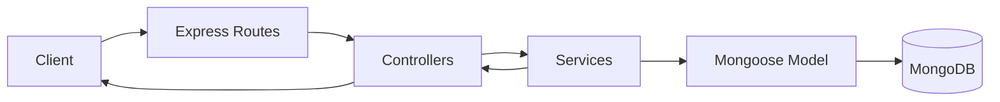

# Product Store Backend

This backend provides a simple Product API for the Product Store project.
It is built with Express and MongoDB (via Mongoose), using a layered structure:

- Route layer: maps HTTP endpoints
- Controller layer: handles request/response behavior
- Service layer: contains business logic and data rules
- Model layer: defines MongoDB data shape
- Config layer: handles database connection

## Stack

- Node.js
- Express 5
- MongoDB
- Mongoose
- dotenv
- cors
- ES Modules (`"type": "module"`)

## Project Structure

```
backend/
	config/
		db.js                    # MongoDB connection setup
	controllers/
		product.controllers.js   # HTTP handlers for product routes
	models/
		product.model.js         # Mongoose Product schema/model
	routes/
		product.routes.js        # Product API routes
	services/
		product.services.js      # Product business logic and DB operations
	server.js                  # App bootstrap and server start
	package.json
	README.md
```

## Architecture

The backend follows a clean, layered request flow:

1. Client calls an API endpoint.
2. Route forwards request to a controller.
3. Controller validates request-level concerns and calls service functions.
4. Service applies business rules and talks to the Product model.
5. Model reads/writes MongoDB.
6. Controller returns a JSON response.

### Request Flow Diagram



## Runtime Behavior

At startup:

- `dotenv.config()` loads environment variables.
- `connectDb()` tries to connect to MongoDB using `MONGO_URI`.
- If DB connection succeeds, Express listens on `PORT` (default `5000`).
- If DB connection fails, process exits with code `1`.

Global middleware:

- `cors()` enables cross-origin requests.
- `express.json()` parses JSON request bodies.

## Data Model

### Product

Fields:

- `name` (String, required)
- `price` (Number, required)
- `imageUrl` (String, required)
- `createdAt` / `updatedAt` (automatic via `timestamps: true`)

## API Endpoints

Base path: `/api/products`

### `GET /api/products`

- Fetch all products.
- Response:
  - `200` with `{ error, message, data }`

### `POST /api/products`

- Create a new product.
- Required body fields: `name`, `price`, `imageUrl`
- Response:
  - `201` on success
  - `400` when required fields are missing

Example body:

```json
{
  "name": "Mechanical Keyboard",
  "price": 89.99,
  "imageUrl": "https://example.com/keyboard.jpg"
}
```

### `PUT /api/products/:id`

- Update an existing product by MongoDB ObjectId.
- Validates ObjectId format before DB call.
- Response:
  - `200` on success
  - `400` for invalid id or product not found

### `DELETE /api/products/:id`

- Delete a product by MongoDB ObjectId.
- Validates ObjectId format before DB call.
- Response:
  - `200` on success
  - `400` for invalid id or product not found

## Error Handling Strategy

- Services throw `Error` objects with `statusCode` for expected business errors.
- Controllers catch and map those errors to HTTP responses.
- Unexpected failures return `500`.

This keeps persistence/business checks in services and response formatting in controllers.

## Environment Variables

Create a `.env` file in `backend/`:

```env
PORT=5000
MONGO_URI=mongodb://localhost:27017/product-store
```

## Run Locally

From `backend/`:

```bash
npm install
npm start
```

Server default URL:

`http://localhost:5000`

## What I Learned Building This Backend

1. How to separate concerns with a layered architecture (routes/controllers/services/models) to keep code organized and easier to scale.
2. How to connect Node.js to MongoDB using Mongoose and model data with schemas.
3. How to validate request data and IDs before database operations to avoid common runtime failures.
4. How to propagate controlled errors from services to controllers with appropriate HTTP status codes.
5. How middleware (`cors`, `express.json`) simplifies API integration with frontend apps.
6. How startup sequencing matters: connect to DB first, then start listening for requests.

## Current Improvement Opportunities

- Add centralized error middleware to standardize all error responses.
- Add stricter input validation (for example, positive numeric `price` and URL format checks).
- Return updated product data in `PUT` responses for better client UX.
- Add tests (unit + integration) for controllers and services.
- Add pagination and filtering to `GET /api/products` as product count grows.
